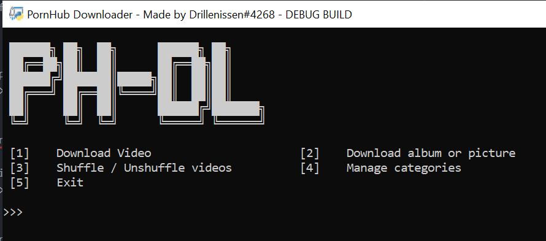
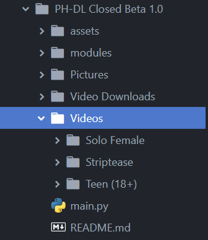

<p align="center">


</p>
<br />
<p align="center">
  <a href="https://github.com/othneildrew/logicguy1/PH-DL">
    
  </a>

  <h3 align="center">PH-DL</h3>

  <p align="center">
    The PornHub Downloader is a script used to download and manage both videos and pictures
    <br />
    <a href="https://github.com/logicguy1/PH-DL"><strong>Explore the docs »</strong></a>
    <br />
    <br />
    <a href="https://github.com/logicguy1/PH-DL/issues">Report Bug</a>
    ·
    <a href="https://github.com/logicguy1/PH-DL/issues">Request Feature</a>
      ·
    <a href="https://discord.gg/anon">Join the discord</a>
  </p>
</p>

<details open="open">
  <summary>Table of Contents</summary>
  <ol>
    <li>
      <a href="#about-the-project">About The Project</a>
      <ul>
        <li><a href="#built-with">Built With</a></li>
      </ul>
    </li>
    <li>
      <a href="#getting-started">Getting Started</a>
      <ul>
        <li><a href="#prerequisites">Prerequisites</a></li>
        <li><a href="#installation">Installation</a></li>
      </ul>
    </li>
    <li><a href="#usage">Usage</a></li>
    <li><a href="#roadmap">Roadmap</a></li>
    <li><a href="#contributing">Contributing</a></li>
    <li><a href="#licence">License</a></li>
    <li><a href="#contact">Contact</a></li>
  </ol>
</details>

## About The Project


The script will allow you to download both images and also files  
If you don't know what I'm talking about when I say images you can locate them [here (NSFW)](https://www.pornhub.com/albums)  

The script supports what I call categories, when you download a video the script will prompt you to type out a category where it will put the downloaded file there, see the image below



The script takes the full url when downloading the files, that looks like this:  
`https://www.pornhub.com/view_video.php?viewkey=ph600dfff994b80`

### Built With

*On inital launch the script will automatically prompt you to install them*
* [Requests](https://github.com/psf/requests)
* [Youtube-Dl](https://github.com/ytdl-org/youtube-dl)
* [BS4](https://www.crummy.com/software/BeautifulSoup/)
* [pynotifier](https://github.com/YuriyLisovskiy/pynotifier)

## Getting Started

To get a local copy up and running follow these simple steps.

### Prerequisites
You need to install Python, that can be done [here](https://www.python.org)

### Installation
1. Clone the repo
   ```sh
   git clone https://github.com/logicguy1/Discord-Nitro-Generator-and-Checker.git
   ```

2. Run the files
   ```sh
   python main.py
   ```

From there simply say yes to everything the script asks you for (after reading and agreeing of cause) and youre set

## Usage
After <a href="#installation">running the files</a> everything should be setup and ready to go for you, if you want to download a video, press `1` and insert the url, it will download the files, give you a notification and then you can choose where you want the video to be saved (what category)

Downloading pictures and albums is a little diffrent since you can eather use a single image or a whole album

Album urls: https://www.pornhub.com/album/70564671
Picture urls: https://www.pornhub.com/photo/803965741

They get downloaded at the same place in the script

## Roadmap

See the [open issues](https://github.com/logicguy1/PH-DL/issues) for a list of proposed features (and known issues).

## Contributing

Contributions are what make the open source community such an amazing place to learn, inspire, and create. Any contributions you make are **greatly appreciated**.

1. Fork the Project
2. Create your Feature Branch (`git checkout -b feature/AmazingFeature`)
3. Commit your Changes (`git commit -m 'Add some AmazingFeature'`)
4. Push to the Branch (`git push origin feature/AmazingFeature`)
5. Open a Pull Request


## Licence

Copyright © 2021 Drillenissen#4268 - logicguy.mailandcontact@gmail.com

Permission is hereby granted, free of charge, to any person obtaining a copy of this software and associated documentation files (the “Software”), to deal in the Software without restriction, including without limitation the rights to use, copy, modify, merge, publish, distribute, sublicense, and/or sell copies of the Software, and to permit persons to whom the Software is furnished to do so, subject to the following conditions:

The above copyright notice and this permission notice shall be included in all copies or substantial portions of the Software.

THE SOFTWARE IS PROVIDED “AS IS”, WITHOUT WARRANTY OF ANY KIND, EXPRESS OR IMPLIED, INCLUDING BUT NOT LIMITED TO THE WARRANTIES OF MERCHANTABILITY, FITNESS FOR A PARTICULAR PURPOSE AND NONINFRINGEMENT. IN NO EVENT SHALL THE AUTHORS OR COPYRIGHT HOLDERS BE LIABLE FOR ANY CLAIM, DAMAGES OR OTHER LIABILITY, WHETHER IN AN ACTION OF CONTRACT, TORT OR OTHERWISE, ARISING FROM, OUT OF OR IN CONNECTION WITH THE SOFTWARE OR THE USE OR OTHER DEALINGS IN THE SOFTWARE.

## Contact

Logicguy - [@Drillenissen#4268](https://www.discordapp.com) - logicguy.mailandcontact@gmail.com

Project Link: [https://github.com/logicguy1/PH-DL](https://github.com/logicguy1/PH-DL)
